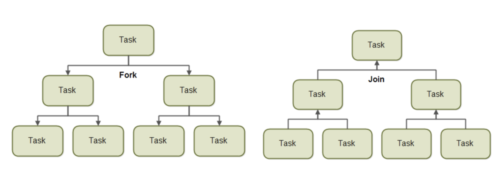
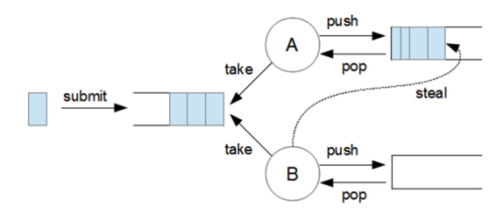

# CHAPTER7 병렬 데이터 처리와 성능

- 자바7 등장 전, 데이터 컬랙션 병렬 처리 과정(어렵당..)
  1. 데이터를 서브파트로 분할
  2. 분할된 서브파트를 각각의 스레드로 할당
  3. 레이스 컨디션 발생하지 않도록 동기화 추가
  4. 부분결과를 합침
- 자바7에 추가된 **포크/조인 프레임워크** 기능! => 더 쉬운 병렬화 수행과 에러 최소화 가능


## 7.1. 병렬 스트림

- **병렬 스트림 parallel stream**
  - 각각의 스레드에서 처리할 수 있도록 스트림 요소를 여러 청크로 분할한 스트림
  - => 모든 멀티코어 프로세서가 각각의 청크 처리하도록 할당
  - 컬렉션에 `parallelStream` 을 호출하면 병렬 스트림 생성됨. 병렬 처리 쉽게 가능~


### 1. 순차 스트림을 병렬 스트림으로 변환하기

- 순차 스트림에 `parallel` 메서드 호출하면 기존의 함수형 리듀싱 연산이 병렬로 처리됨

  ```java
  puvlic static long parallelSum(long n) {
      return Stream.iterate(1L, i -> i + 1)
      			 .limit(n)
      			 .parallel()	// 스트림을 병렬 스트림으로 변환
      			 .reduce(0L, Long::sum);
  }
  ```

  - 스트림 자체에는 아무 변화도 일어나지 않음
  - 호출하면 이후 연산이 병렬로 수행되어야 함을 의미하는 불린 플래그 생성됨

- `sequential` 메서드: 병렬 스트림 -> 순차 스트림
- 한 스트림이 `parallel` 과 `sequential`둘 다 호출한 경우
  - 최종적으로 호출된 메서드가 전체 파이프라인에 영향 미침
- 병렬 스트림은 내부적으로 `ForkJoinPool` 사용. 기본값 그대로 사용할 것 권장


### 2. 스트림 성능 측정

- 병렬화 한다고 무조건 성능이 좋아지지는 않는다
  - ex. `iterate` 연산을 병렬화 하는 경우
    - 이전 연산의 결과에 따라 다음 함수의 입력 달라지기 때문에 `iterate` 연산을 청크로 분할하기 힘듦
    - 따라서, 순차처리 방식과 결과적으로 크게 다른 점 없음 => 스레드 할당하는 오버헤드만 발생

#### **더 특화된 메서드 사용**

- `LongStream.rangeClosed`- 합계 연산 효과적으로 병렬로 실행하는 데 적합
  - 기본형 `long` 을 직접 사용하기 때문에 박싱/언박싱 오버헤드 없음
  - 쉽게 청크로 분할할 수 있는 숫자 범위 생산
  - 적절한 자료구조 사용해야 성능 개선 가능하다!


- 병렬화에 따른 치러야 할 대가들.. 공짜 아니다!
  - 스트림을 재귀적으로 분할하고,
  - 각 서브스트림을 서로 다른 스레드의 리듀싱 연산으로 할당하고,
  - 결과를 하나의 값으로 합쳐야 함


- 멀티코어 간의 데이터 이동은 비싸다!
  - 코어 간 데이터 전송 시간보다 오래 걸리는 작업만 병렬로 다른 코어에서 수행해야 함


### 3. 병렬 스트림의 올바른 사용법

- 공유된 상태를 바꾸는 알고리즘에서 병렬 스트림 사용하면 데이터 레이스 문제 발생


### 4. 병렬 스트림 효과적으로 사용하기

- 직접 성능 측정해 비교
- 박싱 주의
  - 자동 박싱과 언박싱은 성능 저하시킬 수 있음
  - 되도록 기본형 특화 스트림(`IntStream`, `LongStream`, `DoubleStream`) 사용
- 순차 스트림보다 병렬 스트림에서 성능 떨어지는 연산 주의
  -  `limit`, `findFirst` 처럼 요소의 순서에 의존하는 연산에선 병렬 스트림 비싸다
- 전체 파이프라인 연산 비용 고려
- 소량의 데이터에서는 병렬 스트림 NO
- 스트림을 구성하는 자료구조 적절한지 확인
  - 예. 분할 위해 모든 요소 탐색해야 하는 `LinkedList`보다는, 요소 탐색 없이 리스트 분할 가능한 `ArrayList`가 효율적 분할 가능
- 스트림의 특성와 파이프라인의 중간 연산 확인
  - 예. `SIZED` 스트림은 정확히 같은 크기의 두 스트림으로 분할 => 효과적으로 병렬 처리 가능. 반면, 필터 연산은 그렇지 않음
- 최종 연산의 병합과정 비용
  - 비싸면 병렬 스트림으로 얻은 이익이 상쇄될 수 있음

  

**<스트림 소스와 분해성>**

| 소스            | 분해성 |
| --------------- | ------ |
| ArrayList       | 훌륭함 |
| LinkedList      | 나쁨   |
| IntStream.range | 훌륭함 |
| Stream.iterate  | 나쁨   |
| HashSet         | 좋음   |
| TreeSet         | 좋음   |


- 병렬 스트림 수행되는 내부 인프라구조 살펴본다
  - 포크/조인 프레임워크로 처리됨!


## 7.2 포크/조인 프레임워크

- 병렬화 가능한 작업을 재귀적으로 작게 분할, 서브태스크 각각의 결과 합쳐 전체 결과 만들어줌
- 서브태스크를 스래드 풀(`ForkJoinPool`)의 작업자 스레드에 분산 할당하는 `ExecutorService` 인터페이스 구현
  - `ExecutorService`: 워커 스레드를 관리하고 스레드 풀과 성능에 대한 정보 얻을 수 있는 툴을 제공




```java
import java.util.concurrent.ForkJoinPool;
import java.util.concurrent.RecursiveTask;
```


### 1. RecursiveTask 활용

- `RecursiveTask<R>` 의 서브클래스 생성

  - `R` 은 병렬화된 태스크가 생성하는 결과 형식 또는 결과가 없을 때는 `RecursiveAction` 형식
  - `RecursiveTask` 정의하려면 추상메서드 `compute` 구현해야 함

  ```java
  protected abstract R compute();
  ```

  - `compute` 메서드의 구성(`RecursiveTask<R>`의 서브클래스 내에서 오버라이드)
    1. (태스크 충분히 작다면)개별 서브태스크의 결과를 생산하는 부분
    2. 태스크를 서브태스크로 분할하는 부분
       1. 태스크를 두 서브태스크로 분할
       2. 메서드 재귀 호출 => 태스크를 다시 서브태스크로 분할
       3. 모든 서브태스크 연산 완료될 때까지 기다림
       4. 각 서브태스크 결과 합침

- 태스크 분할 임계값 설정 기준? => 뒤에 설명

- 일반적으로 애플리케이션에서 둘 이상의 `ForkJoinPool` 사용하지 않음
  - 한 번만 인스턴스화해서 정적 필드에 싱글턴으로 저장

- 분할 후 정복 divide-and conquer 알고리즘의 병렬화 버전


**ForkJoinSumCalculator 실행**

- 그냥 코드 설명


### 2. 포크/조인 프레임워크를 제대로 사용하는 방법

-  `join` 메서드 호출은 두 서브태스크가 모두 시작된 다음에 한다
  - 메서드 호출하면 태스크가 만들어내는 결과 준비될 때까지 호출자 블록 시키기 때문에
- `RecursiveTask` 내에서는 `ForkJoinPool`의 `invoke` 메서드 호출하지 말아야 함
  - 순차코드에서 병렬 계산 시작할 때만 사용
- 서브태스크에 `fork` 메서드 호출해 `ForkJoinPool` 의 일정 조절 가능
  - 한쪽은 `fork` 메서드, 다른 한쪽은 `compute` 호출하는 것이 효율적 => 한 태스크에는 같은 스레드 재사용할 수 있으므로
- 디버깅 힘들다
- 순차처리보다 무조건 빠르지는 않다
  - 각 서브태스크의 실행시간이 새로운 태스크를 포킹하는 데 드는 시간보다 길다면, 병렬 처리로 성능 개선 가능
  - 그러나 고려해야 할 다른 요소들도 많다..


### 3. 작업 훔치기 

- 태스크 분할 기준에 대한 설명: 적절한 크기로 많은 태스크 포킹하는 게 바람직하다!
- **작업 훔치기 work stealing**
  - 풀에 있는 작업자 스레드의 태스크를 재분배하고 균형 맞출 때까지 사용하는 알고리즘
    - `ForkJoinPool` 이 모든 스레드를 거의 공정하게 분할
  - 각각의 스레드는 이중 연결 리스트를 참조
    - 이중 연결 리스트에는 스레드 자신에게 할당된 태스크 포함돼 있음
    - 작업 끝날 때마다 큐의 헤드에서 다른 태스크 가져와 작업 처리
  - 다른 스레드보다 일찍 일이 끝난 스레드는 다른 스레드 큐의 꼬리에서 작업 훔쳐옴
    - 모든 큐가 빌 때까지 반복
  - => 태스크 크기 작게 나누어야 작업자 스레드 간의 작업부하를 비슷한 수준으로 유지 가능




## 7.3. Spliterator

- `Spliterator`
  - '분할할 수 있는 반복자 splitable iterator'. 자바8에서 제공하는 새로운 인터페이스~ 자동으로 스트림 분할하는 기법
  - `Iterator` 처럼 소스의 요소 탐색 기능 제공 but 병렬 작업에 특화
  - 탐색하려는 데이터를 포함하는 스트림을 어떻게 병렬화할 것 인지 정의

```java
  public interface Spliterator<T> {
    boolean tryAdvance(Consumer<? super T> action);
    Spliterator<T> trySplit();
    long estimateSize();
    int characteristics();
}
```

- 메서드
  - `tryAdvance`: 요소 하나씩 순처적으로 소비하며 탐색할 요소 남았으면 참 리턴
  - `trySplit`: 일부 요소 분할해서 두번째 `Spliterator` 생성
  - `estimateSize`: 탐색해야 할 요소 수 정보 제공할 때 사용


